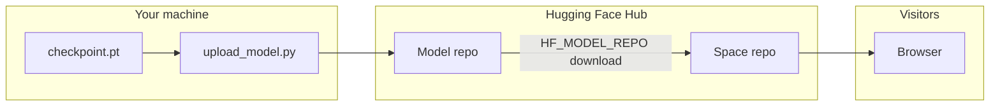

# Hugging Face — Upload Model & Deploy Space

This folder contains everything you need to:

1. **Upload** your trained `checkpoint.pt` to a [Hugging Face Model](https://huggingface.co/docs/hub/models) repository
2. **Deploy** an interactive [Gradio Space](https://huggingface.co/docs/hub/spaces) so anyone can try the model in a browser

```
hugging-face/
├── README.md                 ← you are here
├── model-repo/
│   ├── README.md             ← model card (shown on the Hub)
│   ├── config.json           ← architecture hyperparameters
│   └── upload_model.py       ← one-shot upload script
└── space/
    ├── README.md             ← Space metadata (YAML front matter)
    ├── app.py                ← Gradio demo
    ├── model.py              ← GPT architecture (bundled for the Space)
    ├── inference_utils.py    ← story-boundary helper
    └── requirements.txt
```

---

## Prerequisites

### 1. Hugging Face account

Create a free account at [huggingface.co/join](https://huggingface.co/join).

### 2. Log in from your machine

```powershell
pip install huggingface_hub
huggingface-cli login
```

Paste a token with **write** access from [Settings → Access Tokens](https://huggingface.co/settings/tokens).

Alternatively, set an environment variable:

```powershell
$env:HF_TOKEN = "hf_xxxxxxxx"
```

### 3. Trained artifacts in Episode 06

From the parent folder `episode-06-generation-and-deployment/` you need:

| File | Source |
|------|--------|
| `checkpoint.pt` | Copy from `episode-05-training/` after `train.py` finishes |
| `tinystories_tokenizer.json` | Already in episode-06 (from Episode 2) |
| `model.py` | Already in episode-06 (from Episode 4) |

```powershell
cd episode-06-generation-and-deployment
copy ..\episode-05-training\checkpoint.pt .
```

### 4. Extra packages for upload and Space dev

```powershell
pip install huggingface_hub gradio
```

---

## Part 1 — Upload the model to Hugging Face Hub

### Step 1: Choose a repo name

Pick a unique model id: **`YOUR_USERNAME/tinystories-gpt`**

Example: if your username is `jane`, the repo is `jane/tinystories-gpt`.

### Step 2: Dry run (optional)

Verify all files exist before uploading:

```powershell
cd episode-06-generation-and-deployment\hugging-face\model-repo
python upload_model.py --repo-id YOUR_USERNAME/tinystories-gpt --dry-run
```

### Step 3: Upload

```powershell
python upload_model.py --repo-id YOUR_USERNAME/tinystories-gpt
```

Add `--private` if you want a private model repo.

**What gets uploaded:**

| Hub file | Local source |
|----------|----------------|
| `model.pt` | `episode-06/checkpoint.pt` |
| `tinystories_tokenizer.json` | `episode-06/tinystories_tokenizer.json` |
| `config.json` | `model-repo/config.json` |
| `model.py` | `episode-06/model.py` |
| `README.md` | `model-repo/README.md` (model card) |
| `training_info.json` | Auto-generated (`step`, `val_loss`) |

When it finishes, open:

**https://huggingface.co/YOUR_USERNAME/tinystories-gpt**

You should see the model card, file list, and download buttons.

### Step 4: Customize the model card (optional)

Edit [`model-repo/README.md`](model-repo/README.md) before re-running `upload_model.py`, or edit directly on the Hub website. Replace `YOUR_USERNAME` in the usage example with your real username.

---

## Part 2 — Create the Gradio Space

### Step 1: Create a new Space on the website

1. Go to [huggingface.co/new-space](https://huggingface.co/new-space)
2. **Space name:** e.g. `tinystories-gpt-demo`
3. **SDK:** Gradio
4. **Hardware:** CPU Basic (free tier is enough for this 12M model; GPU is faster)
5. Create the Space

Your Space URL will be: **`https://huggingface.co/spaces/YOUR_USERNAME/tinystories-gpt-demo`**

### Step 2: Set the model repo variable

In the Space repo on Hugging Face:

1. **Settings** → **Repository variables**
2. Add:

| Key | Value |
|-----|-------|
| `HF_MODEL_REPO` | `YOUR_USERNAME/tinystories-gpt` |

This tells `app.py` which model repo to download from.

### Step 3: Push the `space/` folder to the Space repo

**Option A — Git (recommended)**

```powershell
cd episode-06-generation-and-deployment\hugging-face\space

# Clone your empty Space (replace USERNAME and SPACE_NAME)
git clone https://huggingface.co/spaces/USERNAME/tinystories-gpt-demo hf-space
cd hf-space

# Copy Space files (app.py, model.py, etc.)
copy ..\app.py .
copy ..\model.py .
copy ..\inference_utils.py .
copy ..\requirements.txt .
copy ..\README.md .

git add .
git commit -m "Add TinyStories GPT Gradio demo"
git push
```

**Option B — Web UI**

Upload these files from `hugging-face/space/` via the **Files** tab on your Space:

- `app.py`
- `model.py`
- `inference_utils.py`
- `requirements.txt`
- `README.md`

### Step 4: Wait for the build

Hugging Face installs `requirements.txt` and runs `app.py`. First build may take a few minutes (PyTorch download).

Check **Logs** if the Space shows **Building** or **Error**.

### Step 5: Test

Open your Space URL. You should see:

- A green status line with step and val loss (if `HF_MODEL_REPO` is set correctly)
- Prompt box and sliders
- Generated story after clicking **Generate story**

---

## Part 3 — Verify everything works

### Model repo checklist

- [ ] `model.pt` appears under **Files and versions**
- [ ] Model card renders on the main page
- [ ] `config.json` shows correct hyperparameters (4096 vocab, 6 layers, etc.)

### Space checklist

- [ ] Build status is **Running** (not Error)
- [ ] `HF_MODEL_REPO` variable is set
- [ ] Prompt `Once upon a time` produces a short story
- [ ] **Stop at story end** trims a second story opener (if the model runs on)

---

## Customization

### Private model + public Space

Upload with `--private`, then in Space **Settings** enable access to the private model (same account) or use a token with read access.

### Change Space hardware

**Settings → Hardware** — upgrade to CPU upgrade or GPU if generation is slow.

### Point Space at a different checkpoint

Re-run `upload_model.py` to overwrite `model.pt` on the Hub, then **Factory reboot** the Space (Settings → Factory reboot).

### Local test before pushing Space

```powershell
cd episode-06-generation-and-deployment\hugging-face\space
$env:HF_MODEL_REPO = "YOUR_USERNAME/tinystories-gpt"
python app.py
```

Opens a local Gradio URL (downloads the model from Hub on first run).

---

## Troubleshooting

| Problem | Fix |
|---------|-----|
| `401 Unauthorized` on upload | Run `huggingface-cli login` or set `HF_TOKEN` |
| `FileNotFoundError: checkpoint.pt` | Copy checkpoint into `episode-06-generation-and-deployment/` |
| Space: "Set HF_MODEL_REPO" | Add repository variable in Space Settings |
| `ModuleNotFoundError: audioop` / `pyaudioop` on build | HF defaulted to Python 3.13; set `python_version: "3.11"` in `space/README.md` YAML and push again |
| `ImportError: cannot import name 'HfFolder'` | Use Gradio 5+ in Space `README.md` (`sdk_version: 5.12.0`); do not pin `gradio` in `requirements.txt` |
| `Cannot install gradio==4.44.0 and gradio==4.44.1` | HF installs Gradio from `sdk_version`; remove `gradio` from `requirements.txt` |
| Space build fails on `torch` | Check Logs; free tier may need a lighter torch — try `torch` without CUDA in `requirements.txt` |
| Space loads but generation is empty | Confirm `model.pt` on Hub matches your `GPT` architecture (`model.py` in repo) |
| Second story in output | Enable **Stop at story end**; retrain with EOS in `prepare_data.py` for native stopping |

---

## Architecture flow



---

## Related episode files

| Episode | File | Role |
|---------|------|------|
| 02 | `tinystories_tokenizer.json` | Uploaded to Hub |
| 04 | `model.py` | Architecture |
| 05 | `checkpoint.pt` | Trained weights |
| 06 | `generate.py`, `server.py` | Local inference (not required for Hub) |

---

## References

- [Hugging Face Hub — Upload models](https://huggingface.co/docs/hub/models-uploading)
- [Gradio Spaces](https://huggingface.co/docs/hub/spaces)
- [Repository variables for Spaces](https://huggingface.co/docs/hub/spaces-overview#repository-secrets-and-variables)
